[English](README.md) | [日本語](README.ja.md)

# ComfyUI-Info-Prompt-Toolkit

ComfyUIの配線の簡素化と再利用性の向上を軸に、試行結果を次の制作へ活かしやすくするための拡張ノード集です。  
主な機能は、Civitai互換を意識した画像メタデータ保存、同名 `.txt` キャプション保存、XY Plot、Tiled Sampling（`SDXL (with ControlNet Tile)` と `Anima`）、SAM3、Detailer、PixAI Tagger、wildcards、Dynamic Promptsで、ワークフローを強化できます。

## Installation

```bash
cd ComfyUI/custom_nodes
git clone https://github.com/kinorax/comfyui-info-prompt-toolkit.git
cd comfyui-info-prompt-toolkit
pip install -r requirements.txt
```
インストールは ComfyUI Manager 経由が簡単です。

> 注: `SAM3 Prompt To Mask` と `PixAI Tagger` は、インストール後に `ComfyUI/models` 配下へモデルファイルを手動で配置する必要があります。詳細は `Core Nodes` の各説明を参照してください。

## Core Nodes

### SamplerCustom (Sampler Params, Tiled) / SamplerCustom (Sampler Params)

<a href="assets/readme/samplercustom-sampler-params-pair.webp">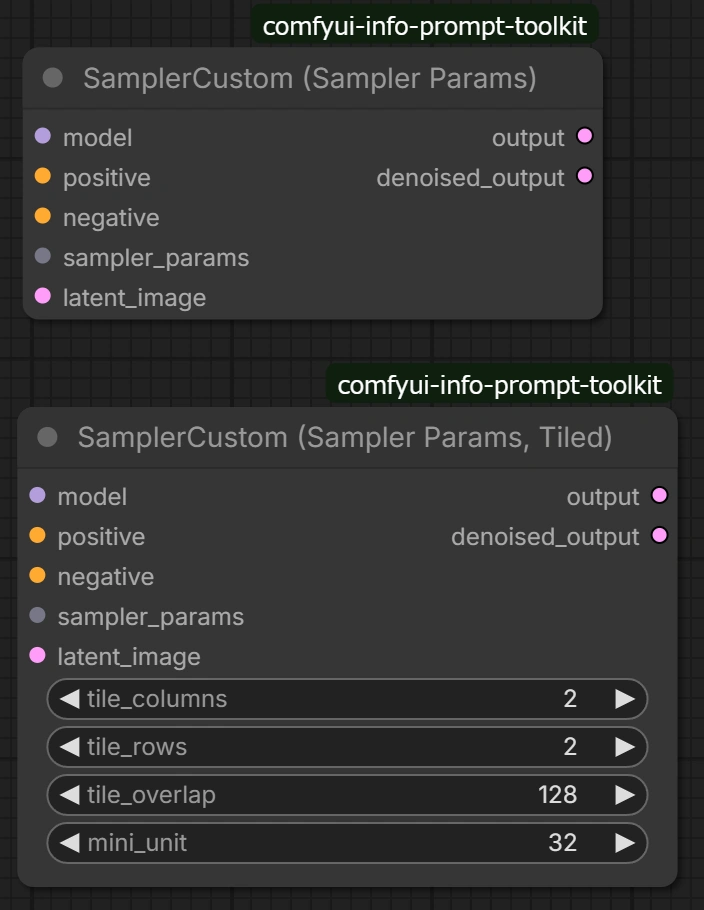</a>
<ul>
  <li><code>sampler_params</code> を受け取り、公式 <code>KSamplerSelect</code> / <code>BasicScheduler</code> / <code>SamplerCustom</code> を使ってサンプリングします（独自のサンプリングロジックは実装していません）。</li>
  <li>Tiled版は通常版と同じサンプリング設定で、推論を空間タイルに分割して実行します。</li>
  <li>Tiled版は VRAM 制約時に有効なだけでなく、モデルの実用対応サイズを超える出力解像度が必要な場合にも有効です。</li>
  <li>Tiled版の動作確認済みモデルは現時点で <code>SDXL (with ControlNet Tile)</code> と <code>Anima</code> です。未確認モデルでも正常動作する可能性はありますが、互換性は保証していません。</li>
</ul>
<br clear="left">

### Sampler Params

<a href="assets/readme/sampler-params.webp">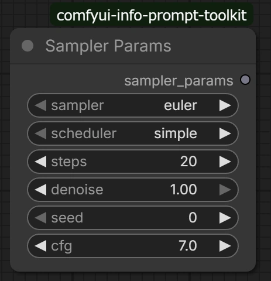</a>
<ul>
  <li>sampler/scheduler/steps/denoise/seed/cfg を1本の <code>sampler_params</code> に集約します。</li>
  <li>配線削減と設定再利用のしやすさを両立できます。</li>
</ul>
<br clear="left">

### XY Plot Start / XY Plot Modifier / XY Plot End

<a href="assets/readme/xy-plot-start-modifier-end.webp">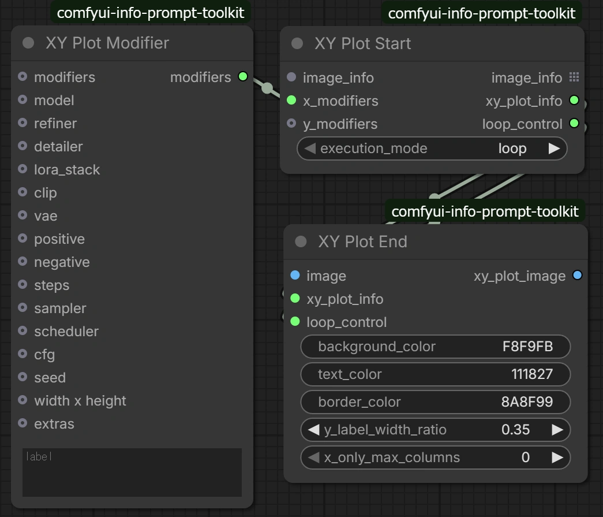</a>
<ul>
  <li><code>XY Plot Modifier</code> は軸ごとの変更セット（<code>label</code> + <code>changes</code>）を配列として連結し、X/Y軸の条件バリエーションを定義します。</li>
  <li><code>XY Plot Start</code> はベース <code>image_info</code> に X/Y の modifier を適用してセルごとの <code>image_info</code> を生成し、<code>list</code>（一括）または <code>loop</code>（逐次）で出力します。</li>
  <li><code>XY Plot End</code> は <code>xy_plot_info</code> と生成画像を受け取り、軸ラベル付きのグリッド画像 <code>xy_plot_image</code> を合成します。</li>
  <li><code>loop</code> モードでは <code>Start</code> と <code>End</code> が <code>loop_control</code> で連携して全セルを順に処理します。</li>
</ul>
<br clear="left">

### Image Info Context

<a href="assets/readme/image-info-context.webp">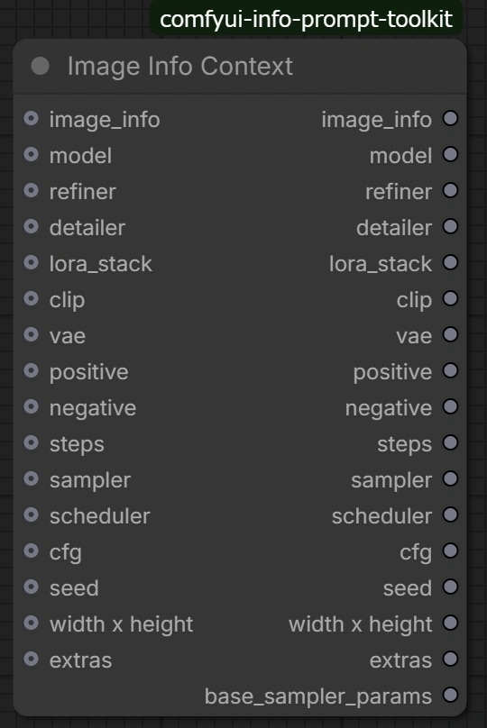</a>
<ul>
  <li><code>Image Info Context</code> は、ベース <code>image_info</code> に対して接続された入力項目だけを反映し、更新後の <code>image_info</code> を再構成します。</li>
  <li><code>positive</code> が接続されている場合は <code>&lt;lora:...:...&gt;</code> を抽出し、タグ除去後の <code>positive</code> と <code>lora_stack</code> へ反映します。</li>
  <li><code>extras</code> は既存 <code>image_info.extras</code> にマージされ、重複キーは入力側の値で上書きされます。</li>
  <li>更新後の各項目に加えて、<code>base_sampler_params</code>（<code>denoise=1.0</code> 固定）を出力し、後段のサンプリングノードへ接続しやすくします。</li>
</ul>
<br clear="left">

### Image Info Fallback

<a href="assets/readme/image-info-fallback.webp">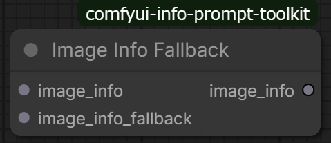</a>
<ul>
  <li><code>Image Info Fallback</code> は、優先側 <code>image_info</code> の未設定項目を <code>image_info_fallback</code> から補完します。</li>
  <li>補完は欠損項目に限定され、優先側に値がある項目は上書きしません。</li>
  <li><code>extras</code> は未存在キーのみを追加する形でマージされ、既存キーは保持されます。</li>
  <li>優先側 <code>positive</code> が存在する場合、<code>lora_stack</code> は fallback 側から補完しません。</li>
</ul>
<br clear="left">

### Detailer Start / Detailer End

<a href="assets/readme/detailer-start-end.webp">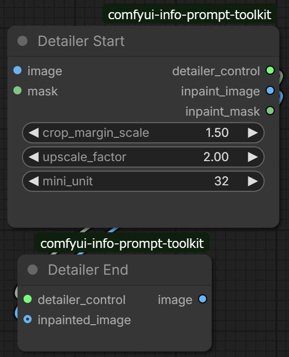</a>
<ul>
  <li><code>Detailer Start</code> は、入力 <code>mask</code> の値が <code>0.0</code> より大きい領域から <code>bounding box (bbox)</code> を検出し、<code>crop_margin_scale</code> で拡張した処理領域を作成します。</li>
  <li>処理領域は <code>upscale_factor</code> で事前拡大され、出力サイズは <code>mini_unit</code>（8/16/32/64）で割り切れるように切り上げたうえで <code>center padding</code> して整形されます。</li>
  <li>元画像への合成には入力 <code>mask</code> の濃淡を保持した <code>soft mask</code> が使われ、その情報は <code>detailer_control</code> 側に保持されます。</li>
  <li><code>Detailer End</code> は <code>inpainted_image</code> を受け取り、保持済みの <code>soft mask</code> を使って元画像へ <code>composite</code> します。</li>
  <li><code>inpainted_image</code> の解像度が期待する <code>canvas</code> サイズと異なる場合でも、合成前に自動でリサイズしてから復元します。</li>
  <li>対象領域が検出されない場合、<code>Detailer End</code> は <code>inpainted_image</code> を評価せず、元画像をそのまま返します。</li>
</ul>
<br clear="left">

### SAM3 Prompt To Mask

<a href="assets/readme/sam3-prompt-to-mask.webp">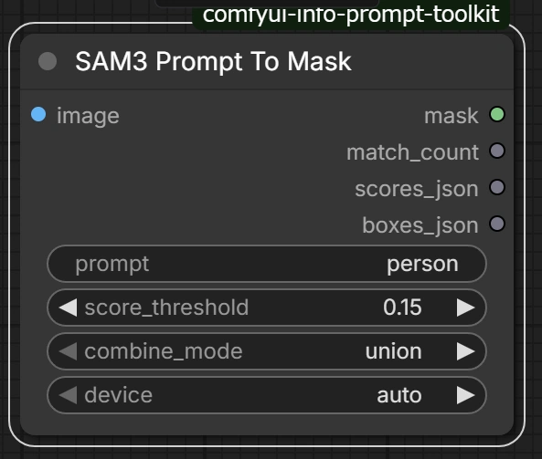</a>
<ul>
  <li><code>SAM3 Prompt To Mask</code> はテキストプロンプトから <code>soft mask</code> を生成する単機能ノードです。<code>prompt</code> のカンマ区切りは OR 条件として扱い、<code>score_threshold</code> と <code>combine_mode</code>（<code>union</code> / <code>top1</code>）で採用結果を調整できます。</li>
  <li>出力は二値化しない <code>soft mask</code> で、しきい値化や領域調整は後段ノードで行う前提です。</li>
  <li>このノードは、追加で <code>pip</code> インストールが必要な依存パッケージを最小限に抑えることを最優先に設計しています。既存の SAM3 系拡張で Python 環境への影響が大きいケースがあったためです。</li>
  <li>その方針により SAM3 関連機能は意図的に単機能へ限定しており、現時点でこれ以上の機能追加予定はありません。</li>
  <li><code>sam3.pt</code> を <code>ComfyUI/models/sam3</code> に配置してください（取得元: <a href="https://huggingface.co/facebook/sam3">facebook/sam3</a>。SAM3.1以降は動作未確認です）。</li>
</ul>
<br clear="left">

### PixAI Tagger

<a href="assets/readme/pixai-tagger.webp">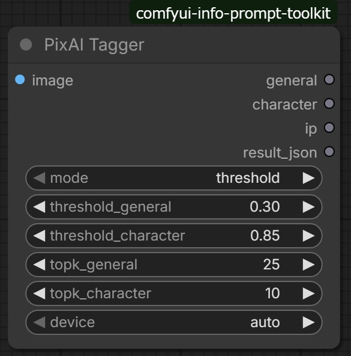</a>
<ul>
  <li><code>PixAI Tagger</code> は、画像から <code>general</code> / <code>character</code> / <code>ip</code> タグを推定し、プロンプト向けテキストとして出力するノードです。</li>
  <li>タグ選別は <code>mode</code> で切り替えでき、<code>threshold</code> では閾値ベース、<code>topk</code> ではカテゴリごとの上位件数ベースで出力を制御できます。</li>
  <li>本ノードは <code>onnxruntime</code> / <code>onnxruntime-gpu</code> に依存せず、ローカルの PyTorch 実装で動作します。</li>
  <li>ONNX Runtime 系の追加導入を避けることで、Python 環境の変化に対して影響を受けにくい構成を重視しています。</li>
  <li>PixAI Tagger v0.9 バンドル（<code>model_v0.9.pth</code> / <code>tags_v0.9_13k.json</code> / <code>char_ip_map.json</code>）を <code>ComfyUI/models/pixai_tagger</code> に配置してください（取得元: <a href="https://huggingface.co/pixai-labs/pixai-tagger-v0.9">pixai-labs/pixai-tagger-v0.9</a>）。</li>
</ul>
<br clear="left">

### Prompt Template

<a href="assets/readme/prompt-template.webp">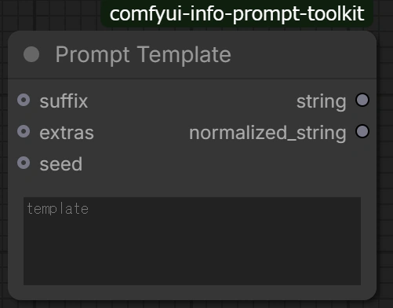</a>
<ul>
  <li><code>Prompt Template</code> は、テンプレート文字列から最終プロンプトを生成するノードです。<code>//</code> / <code>/*...*/</code> コメント除去、wildcard 展開、Dynamic Prompts 展開、<code>$key</code> 置換を1ノードで処理します。</li>
  <li>wildcard は <code>ComfyUI/user/info_prompt_toolkit/wildcards</code> 配下の <code>.txt</code> を参照し、<code>__name__</code>（ランダム）と <code>__name__#N</code>（固定選択）を使えます。<code>weight::value</code> 形式の重み付き行にも対応します。</li>
  <li>Dynamic Prompts は <code>{a|b}</code> に加えて、重み付き・複数選択・範囲指定・<code>@</code> cycle sampler を扱えます。</li>
  <li><code>seed</code> を接続すると random 系の展開結果を再現でき、未接続時は非決定になります。</li>
  <li><code>extras</code> を接続すると <code>$key</code> を置換し、未定義キーはそのまま残します。<code>suffix</code> はテンプレート展開後に末尾へ連結されます。</li>
  <li>出力は、展開結果の <code>string</code> と、トークン整形済みの <code>normalized_string</code> の2系統です。</li>
</ul>
<br clear="left">

### Image Reader / Image Saver

<a href="assets/readme/image-reader-and-image-saver.webp">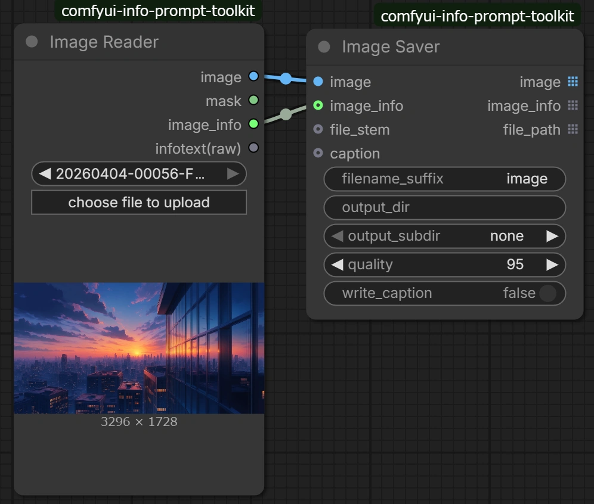</a>
<ul>
  <li><code>Image Reader</code> と <code>Image Saver</code> は、生成情報（<code>A1111 infotext</code> / <code>image_info</code>）を保持した画像の再利用ワークフローを支える中核ノードです。</li>
  <li><code>Image Saver</code> は Civitai の Post images で prompt / model / 複数 LoRA を認識させやすい <code>A1111 infotext</code> を WebP メタデータへ埋め込めます。</li>
  <li><code>Image Reader</code> の右クリックメニュー <code>Check Referenced Models...</code> では、画像内 infotext から参照情報を解析し、Model / Refiner / Detailer / CLIP / VAE / LoRA を一覧確認できます。</li>
  <li>同画面では各参照のローカル存在状態（Present / Missing）も確認でき、必要に応じて <code>View Model Info...</code> へ遷移して詳細を確認できます。</li>
  <li><code>Image Saver</code> は自動連番と <code>file_stem</code> 指定の両方に対応し、運用に合わせて命名方式を切り替えられます。</li>
  <li><code>write_caption</code> を有効にすると、画像と同名の <code>.txt</code> キャプションファイルを同時に出力できます。</li>
</ul>
<br clear="left">

### Image Directory Reader

<a href="assets/readme/image-directory-reader.webp">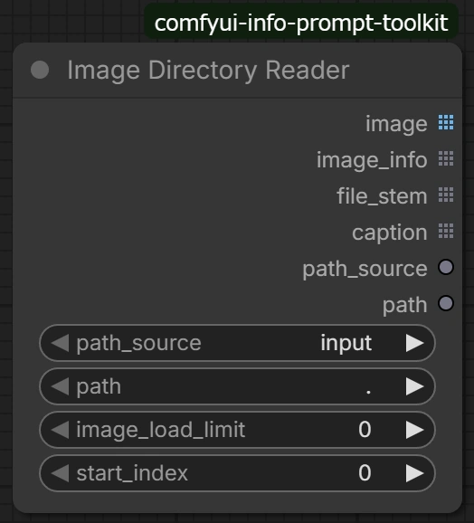</a>
<ul>
  <li><code>Image Directory Reader</code> は、ComfyUI の <code>input</code> / <code>output</code> 配下サブディレクトリから複数画像を読み込み、対応する情報をリストで出力するノードです。</li>
  <li><code>path_source</code> と <code>path</code>（相対ディレクトリ）で読込先を選択し、<code>start_index</code> と <code>image_load_limit</code> で対象範囲を制御できます（<code>0</code> は無制限）。</li>
  <li>対象画像はファイル名の大文字小文字を区別しない順序でソートして選択されるため、バッチ結果を再現しやすくなります。</li>
  <li>各画像に対して <code>image</code>、A1111 infotext から復元・正規化した <code>image_info</code>、拡張子なしファイル名 <code>file_stem</code>、同名 <code>.txt</code> の <code>caption</code>（未存在時は空文字）を出力します。</li>
  <li><code>path_source</code> と <code>path</code> も出力するため、<code>Caption File Saver</code> へそのまま接続しやすい構成です。</li>
</ul>
<br clear="left">

### Video Reader / Video Saver

<a href="assets/readme/video-reader-and-video-saver.webp">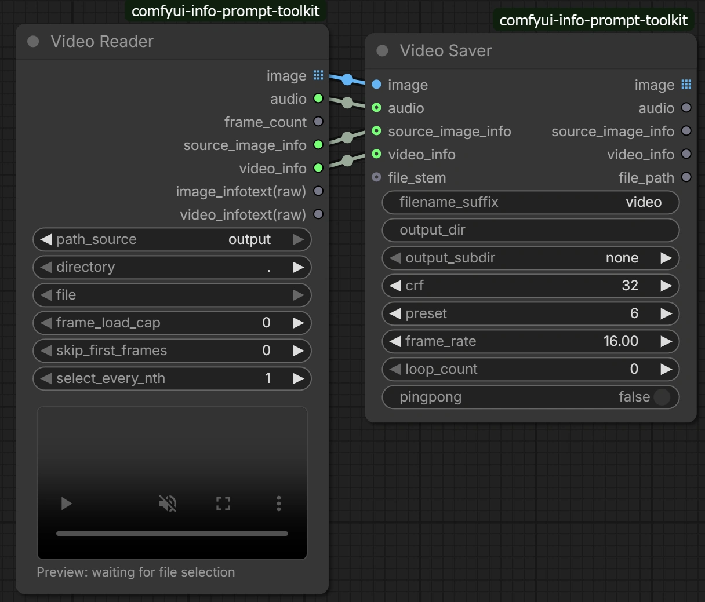</a>
<ul>
  <li><code>Video Reader</code> と <code>Video Saver</code> は、生成情報（<code>source_image_info</code> / <code>video_info</code>）を保持した動画の再利用ワークフローを支えるペアノードです。</li>
  <li><code>Video Reader</code> の <code>image</code> はリスト出力です。後段がバッチ処理前提、またはリスト展開を想定していない場合は <code>Image List To Batch</code> を経由してください。</li>
  <li><code>Video Saver</code> の表示中の <code>crf</code> は画質とファイルサイズのバランスを調整する値で、一般に小さいほど高画質・大容量になりやすくなります。</li>
  <li><code>source_image_info</code> は元画像の情報、<code>video_info</code> は動画関連の情報として保持され、あとから見直しや比較がしやすくなります。</li>
  <li><code>Video Reader</code> / <code>Video Saver</code> は、<code>PyAV</code> (<code>av</code>) がインストールされた環境で利用可能です。利用可能な codec は、ユーザー環境の PyAV / FFmpeg build に依存します。</li>
</ul>
<br clear="left">

### Mask Overlay Comparer

<a href="assets/readme/mask-overlay-comparer.webp">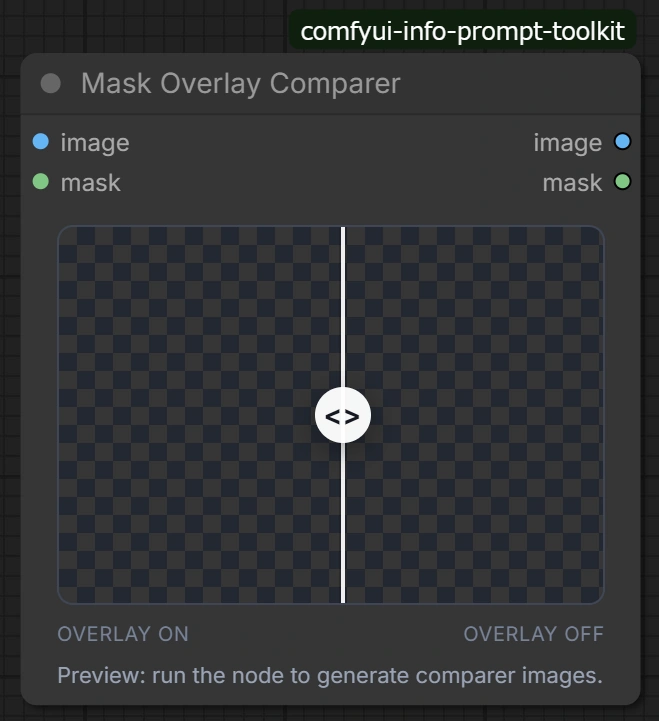</a>
<ul>
  <li><code>Mask Overlay Comparer</code> は、<code>image</code> に <code>mask</code> を重ねた結果をスライダーで比較表示し、マスクの当たり方を視覚的に確認しやすくするノードです。</li>
  <li>比較表示は、見やすくした背景画像と、マスク重ね合わせ画像の2面を切り替える形で行います。</li>
  <li><code>mask</code> は二値化せず、<code>0.0..1.0</code> の値をそのまま可視化に使います。</li>
  <li>可視化ルールは、<code>mask = 0.0</code> は変化なし、<code>mask = 1.0</code> は黒、それ以外の途中値は青系ティントで重なる挙動です。</li>
  <li>プレビュー生成の前提として、<code>image</code> と <code>mask</code> は同じ解像度で扱ってください。</li>
</ul>
<br clear="left">

### Aspect Ratio to Size

<a href="assets/readme/aspect-ratio-to-size.webp">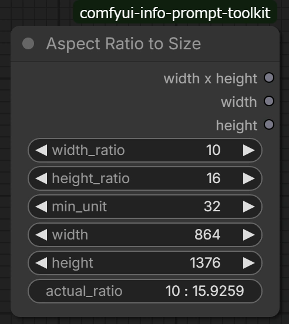</a>
<ul>
  <li><code>Aspect Ratio to Size</code> は、ノードUIのウィジェット操作に合わせて、実行前の段階で <code>width</code> / <code>height</code> を自動再計算し、<code>actual_ratio</code> とあわせて確認しながら調整できるノードです。</li>
  <li><code>width_ratio : height_ratio</code> と基準サイズから、<code>width</code> または <code>height</code> のどちらかを基準に、もう片側の値を比率に沿って算出します。</li>
  <li>算出サイズは <code>min_unit</code>（8 / 16 / 32 / 64）単位に揃えられるため、運用しやすい解像度へ調整しやすくなります。</li>
  <li><code>width x height</code> は、幅と高さを1本で扱えるサイズ出力で、サイズ入力を受けるノードへ渡しやすい形式です。</li>
</ul>
<br clear="left">

### Load New Model / Use Loaded Model

<a href="assets/readme/load-new-model-and-use-loaded-model.webp">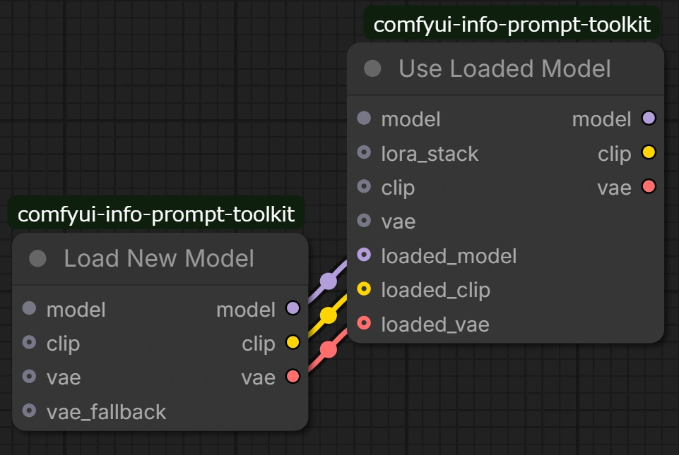</a>
<ul>
  <li><code>Load New Model</code> と <code>Use Loaded Model</code> は、モデル読み込みと再利用を分担するペアノードです。</li>
  <li><code>Load New Model</code> は、Selector系ノードから受けた情報をもとに <code>model</code> / <code>clip</code> / <code>vae</code> を読み出します。</li>
  <li><code>Use Loaded Model</code> は、デフォルトではノード内部で <code>lora_stack</code> を適用します。<code>loaded_model</code> / <code>loaded_clip</code> 側で同じ LoRA 適用を済ませている場合は <code>apply_lora_stack=false</code> にしてください。</li>
  <li><code>Lora Stack Lorader</code> や <code>TorchCompile</code> 系ノードを <code>Use Loaded Model</code> の前段に挟みたい場合は、<code>Load New Model</code> の出力をそれらへ通し、最終出力を <code>loaded_model</code> / <code>loaded_clip</code> / <code>loaded_vae</code> に接続したうえで <code>apply_lora_stack=false</code> を使います。</li>
  <li><code>Use Loaded Model</code> は、<code>model</code> と <code>lora_stack</code> などの条件組み合わせごとに結果を切り替えるため、同条件での重複読み込みを減らしやすくなります。</li>
  <li><code>lora_stack</code> は要素の順序と強度も条件に含まれるため、並び順や値が変わると別条件として扱われます。</li>
  <li>対応対象は checkpoint 系と diffusion_models 系です。</li>
</ul>
<br clear="left">

## License

- このプロジェクトの作者によるソースコード部分は、[GPL-3.0-or-later](LICENSE) の下で提供します。
- このリポジトリには、別ライセンスで配布される vendored `sam3` も含まれます。`sam3` には [SAM License](vendor/LICENSE.sam3) が適用されます。
- サードパーティーコンポーネントの詳細は [THIRD_PARTY_LICENSES.md](THIRD_PARTY_LICENSES.md) を参照してください。
- ユーザーが別途取得して配置するモデルファイルやその他の外部アセットには、それぞれの配布元のライセンスおよび利用条件が適用されます。
